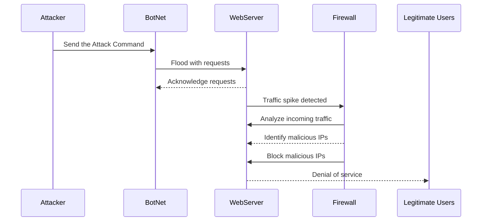

# DDoS Attack Diagram

This Denial of service diagram is a representation of the processes that occur during such an attack. Firstly, the attacker sends a command for a BotNet to flood the victim web server. The Botnet then floods the web server with requests, which are then acknowlaged by the server. The traffic spike caused by the botnet flooding the server with requests causes the Firewall to inspect incoming traffic. The firewall then attempts to cut off the bad actor identifying and blocking the IPs. Through exausting the servers resources, the Attacker denies service to legitimate users