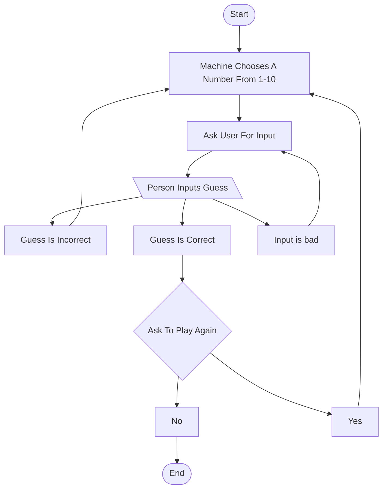

# Guessing Game
This is a flowchart representing the logic that would be seen in a Guessing Game where a computer generates a number from 1 - 10.

```mermaid
flowchart TD
Start([Start]) --> 1[Machine Chooses Number 1 - 10]
1[Machine Chooses Number 1 - 10] --> 5[Ask User For Input]
5[Ask User For Input] --> id1[\Person Inputs Guess\] 
id1[\Person Inputs Guess\] --> 4[Input is bad]
4[Input is bad] --> 5[Ask User For Input]
id1[\Person Inputs Guess\] --> 2[Guess Is Incorrect]
id1[\Person Inputs Guess\]--> 3[Guess Is Correct]
2[Guess Is Incorrect] --> 1[Machine Chooses A Number From 1-10]
3[Guess Is Correct] --> id2{Ask To Play Again} 
id2{Ask To Play Again} --> 7[No]
id2{Ask To Play Again} --> 8[Yes]
7[No] --> End([End])
8[Yes] --> 1[Machine Chooses A Number From 1-10]

```