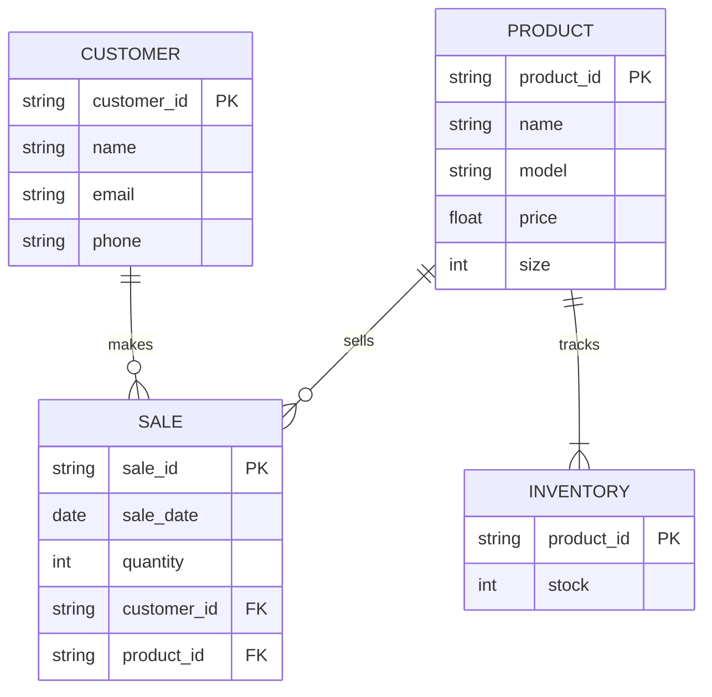

# Nike Shoe Store

This Diagram represents how a Nike Store database might handle their information. The Customer entity represents an individual assigned a unique ID (Identifier) along with a name, email, and phone connected to that identifier. The Sale entity represents a transaction, granted a unique sale identifier that can be tracked. It is also assigned a date, amount (quantity), and connected to a customer_id and product_id. The Product Entity represents an individual product sold at the store, assigned a unique ID, along with a name, model, price, and size tied to the Product identifier. The Inventory entity stores both products by their IDs as well as the amount in stock. The relationship between the entities is as follows:

PRODUCT to SALE (||--o{): Indicates that a product can be sold in multiple sales, but each sale references a specific product. \
CUSTOMER to SALE (||--o{): Indicates that a customer can make multiple purchases, while each sale is associated with one customer. \
PRODUCT to INVENTORY (||--o{): Shows that each product has an associated inventory record that tracks its stock level.